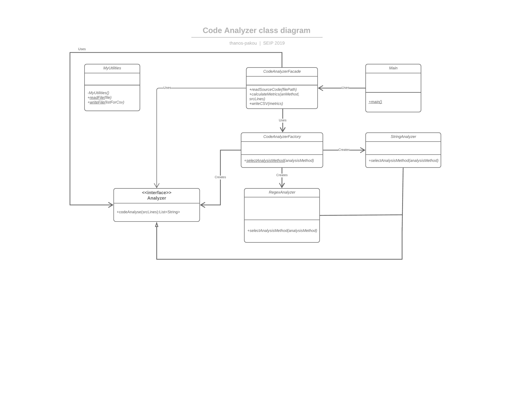

# codeAnalyser

## Description

This is a maven project. The application gets as arguments a java file path and an analysis method (regex or string)
from the console. Then, it calculates 3 metrics (Lines of code, number of classes and number of methods) of
the specific file and generates a csv file with the results saving it to the ```seip2019/codeAnalyzer/src/main/resources```


## Technology Stack
* Java -version 10.0.2
* Apache Maven -version 3.5.3

Maven doesn't have any dependencies.

## UML class diagram



## Run the application

To run the application you need:
* [Java](https://www.oracle.com/technetwork/java/javase/downloads/jre8-downloads-2133155.html)
* [Gitbash](https://git-scm.com/downloads)
* [Apache Maven](https://maven.apache.org/download.cgi)

installed in your machine


Then, you need to clone the project to your local machine. Download Git, and open gitbash to the location you want the project to be in. Then type
```
git clone https://github.com/thanos-pakou/SEIP_lab_assignments_2019.git
```


Once you are done open a terminal and navigate to the folder seip2019. Then type
```
mvn install
```

This will generate a target directory in the seip2019/codeAnalyzer. Navigate to that file via terminal and type
```
java -jar {codeAnalyser-0.0.1-SNAPSHOT.jar ../src/main/resources/example.java} [regex | string}
```

If everything is ok you will be able to see the test.csv file with the results in the 
```seip2019/codeAnalyzer/target``` directory 